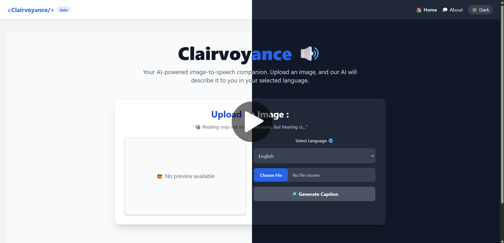

# 😎 Clairvoyance : Multi-Language Image-to-Speech AI Tool 🧑🏻‍🦯‍➡️

Clairvoyance is a web-based AI solution that empowers visually impaired users to understand their surroundings by converting uploaded images into descriptive audio using advanced image captioning and speech synthesis. Developed by Team BitByBit as part of IGNITATHON 2025 (Track: AI for Good), the project bridges the accessibility gap using generative AI.


## 🧠 Problem Statement

Visually impaired individuals often struggle to understand visual content shared on digital platforms. They require human assistance for interpreting such information, leading to reduced independence in a digitally-driven world.


## 🎯 Objective

To design an accessible web-based tool that:

* Accepts image input from the user
* Automatically generates descriptive captions using AI
* Converts the captions into natural-sounding audio output
* Offers multi-language and offline support for broader usability


## 💡 Key Features

| Feature                     | Description                                                   |
| --------------------------- | ------------------------------------------------------------- |
| 🖼️ Image Upload             | Upload from local device (file picker)                        |
| 🧠 AI-Powered Captioning    | Uses pre-trained BLIP model for accurate image descriptions   |
| 🔊 Audio Narration          | Converts caption text into speech using gTTS                  |
| 🌐 Language Translation     | Translate captions into native languages using translate api  |
| ♿ Accessibility-Friendly   | Designed with responsive UI with dark mode support            |
<!-- | 🛜 Optional Offline Support | Works with offline models and browser-based TTS (stretch goal)| -->


## 🏗️ System Architecture

```plaintext
User (Image Upload)
        ↓
Frontend (Next.js + Tailwind CSS)
        ↓
FastAPI Backend
        ↓
[AI Model]  ← BLIP via HuggingFace
        ↓
Caption Text
        ↓
Text-to-Speech (gTTS/pyttsx3)
        ↓
Audio Output (MP3 playback)
```


## 🛠 Tech Stack

| Layer     | Tools Used                              |
| ----------| --------------------------------------- |
| Frontend  | Next.js, Tailwind CSS                   |
| Backend   | Python (FastAPI)                        |
| AI Model  | BLIP (via HuggingFace Transformers)     |
| TTS       | gTTS (Google Text-to-Speech)            |
| Translate | Google Translate API                    |
<!--| Hosting   | Render (frontend + backend)       | -->


## 🚀 Getting Started

### Backend Setup

  - install python 3.10+
  - clone the repository
  - navigate to `./Clairvoyance/backend` in terminal
  - create a py virtual environment and active it
  - run to install all required packages :

  ```
  pip install -r requirements.txt
  ```

  - to start the backend run
  
  ```
  uvicorn main:app
  ```

### Frontend Setup
  - navigate to `frontend` folder in terminal
  - run to install all required packages :

  ```
  npm install
  ```  

 - to start the frontend
  
  ```
  npm run dev
  ```

Visit [`http://localhost:3000`](http://localhost:3000) in your browser. **Clairvoyance** is live now and fully functional.


## 🏆 Team BitByBit

| Name                                                   |Role                                                               |
| -------------------------------------------------------|-------------------------------------------------------------------|
| 👸🏻 [Anoushka Chaudhuri](https://github.com/awkwardish)| Project Lead, UI design, Text-to-speech integration, Research.     |
| 👨🏻‍💻 [Soumyajit Das](https://github.com/soumyajiitdas/) | Frontend dev, UI design, Backend integration, Multilingual support.|
| 👩🏻‍💻 [Srija Sarkar](https://github.com/srijasarkar133)  | Text-to-speech and translation integration, Testing.               |
| 👨🏻‍💻 [Animesh Nandy](https://github.com/ani-11-pro)     | Research and testing compatibility of components.                  |


<!-- ## 🤖 AI Models Used

* Pre-trained BLIP (Bootstrapped Language Image Pretraining) model from HuggingFace
* Google Text-to-Speech (gTTS) for audio output
* Google Translate API for multilingual support -->


## 🎥 Project Demo

### User Interface Showcase :
<a href="assets/ui_showcase.mp4" target="_blank">
  
</a>


## 📑 License

This project is licensed under the MIT License — see the [`LICENSE`](./LICENSE) file for details.

## ✨ Acknowledgements

* HuggingFace for open-source BLIP model
* Google Cloud APIs
* IGNITATHON 2025 organizing team

---
<p align=center><strong>Built with love, code, and a mission to make vision audible ❤️</strong></p>

---